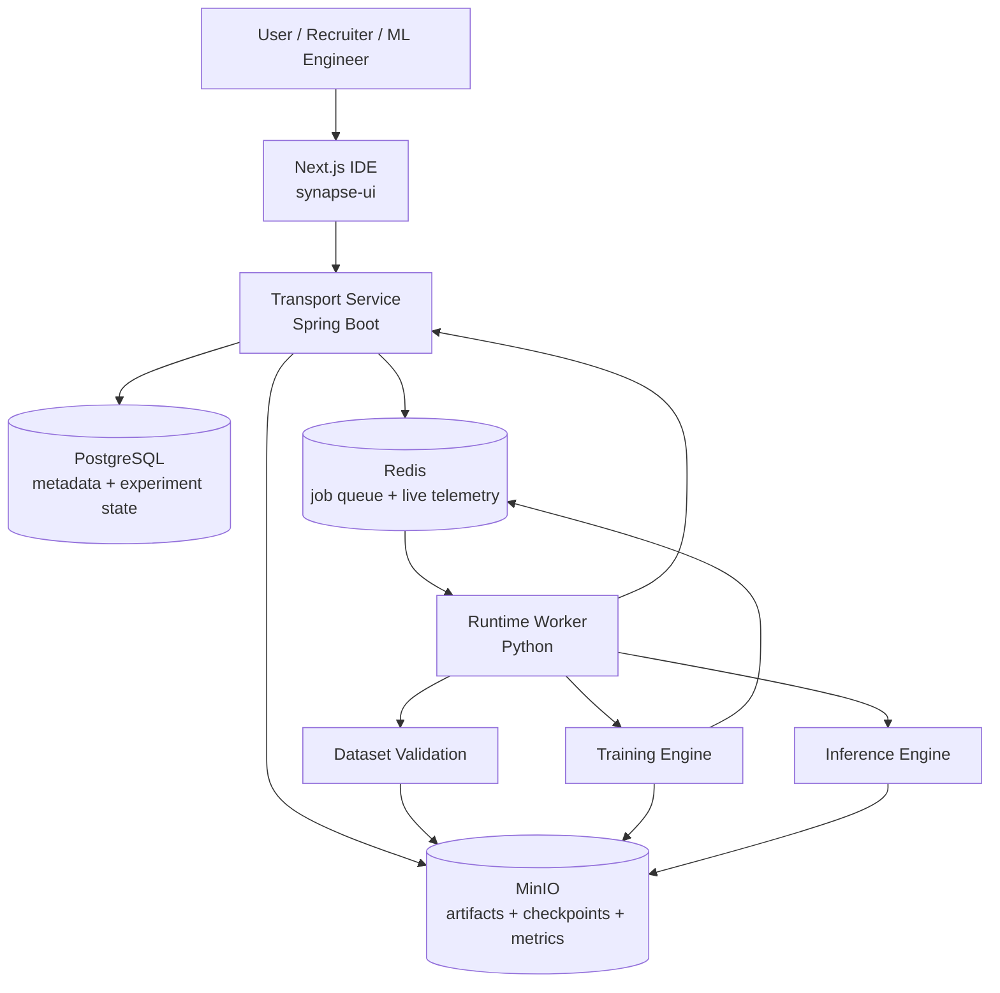

# Synapse

Synapse is a full-stack neuromorphic ML system built as a production-style control plane plus execution plane: a `Next.js` IDE for experiment design, a `Spring Boot` transport service for orchestration and metadata, and a `Python` runtime that validates datasets, builds spiking neural networks from an IR graph, trains models, emits live telemetry, and stores artifacts in object storage. The point of the project is not just to train SNNs—it is to show the engineering discipline behind them: queue-backed execution, live observability, artifact versioning, explicit service boundaries, and a benchmark suite that measures performance, storage efficiency, latency, and runtime correctness.

## Benchmark Highlights

> Benchmarks are intentionally kept in-repo to show measured systems behavior, not just architecture claims.

| Benchmark                         | Headline result                                                                                                           | Why it matters                                                                                                        | Source                                                                                                                                               |
| --------------------------------- | ------------------------------------------------------------------------------------------------------------------------- | --------------------------------------------------------------------------------------------------------------------- | ---------------------------------------------------------------------------------------------------------------------------------------------------- |
| Async telemetry pipeline overhead | **97.65%** throughput retained versus no telemetry for reduced async Redis logging                                        | Shows observability can stay on the hot path without destroying training throughput                                   | [`benchmark/results/async_pipeline_overhead/20260617T073705Z/summary.json`](benchmark/results/async_pipeline_overhead/20260617T073705Z/summary.json) |
| Event pipeline latency            | **Queue p95: 27.53 ms** and **transport-ready p50: 528.19 ms** at concurrency `1`                                         | Separates Redis queue latency from orchestration latency, which is the useful systems split for debugging bottlenecks | [`benchmark/results/event_pipeline_latency/20260617T090029Z/summary.json`](benchmark/results/event_pipeline_latency/20260617T090029Z/summary.json)   |
| Failure detection speed           | Telemetry detects collapse **21 steps earlier on average** than conventional training signals                             | Demonstrates why internal layer telemetry is operationally useful, not just visually interesting                      | [`benchmark/results/failure_detection_speed/20260617T074103Z/summary.json`](benchmark/results/failure_detection_speed/20260617T074103Z/summary.json) |
| Exhaustive graph correctness      | **147** runtime compatibility cases across every declared encoder, neuron, and layer family; current pass rate **28.57%** | Turns runtime correctness into an explicit engineering target and exposes unsupported graph paths early               | [`benchmark/results/graph_correctness/20260617T085321Z/summary.json`](benchmark/results/graph_correctness/20260617T085321Z/summary.json)             |
| Telemetry storage reduction       | Hierarchical logging cuts telemetry size by **99.9639%** (**2770×** smaller than raw full-tensor logging)                 | Makes live telemetry practical without paying full-tensor storage costs                                               | [`benchmark/results/storage_reduction/20260617T073738Z/summary.json`](benchmark/results/storage_reduction/20260617T073738Z/summary.json)             |

## Architecture



## Why this project is interesting

Synapse is designed like a real distributed ML product rather than a single training script:

- **Control plane / data plane split**: `synapse-transport` owns orchestration and metadata; `synapse-runtime` owns execution.
- **Queue-backed execution**: training, dataset validation, and inference are runtime jobs rather than direct synchronous API calls.
- **Live telemetry**: the runtime publishes reduced model telemetry during training so failures can be detected before loss curves fully degrade.
- **Artifact-oriented storage**: datasets, checkpoints, metrics, and inference outputs are stored in `MinIO`, while `PostgreSQL` only tracks durable metadata.
- **Benchmark-first engineering**: the repository includes dedicated benchmarks for latency, throughput overhead, failure detection, graph correctness, and telemetry compression.

## System design principles

The implementation follows a few strong architectural rules pulled directly from the codebase and docs in `docs/`:

- The **frontend talks to transport**, not directly to runtime workers.
- The **transport service** stores experiment state, artifact references, and runtime callback results.
- The **runtime is stateless** between jobs; persistent outputs live in `MinIO` and operational coordination lives in `Redis`.
- **Telemetry is treated as a systems concern**, not a side-effect: it is measured for throughput cost, latency, and storage footprint.
- **Model graphs are runtime-tested**, not assumed correct based on schema alone.

## Benchmark suite

The benchmark harness under `benchmark/` is part of the project story, not an afterthought.

| Script                                                                         | Purpose                                                                                     |
| ------------------------------------------------------------------------------ | ------------------------------------------------------------------------------------------- |
| [`benchmark/async_pipeline_overhead.py`](benchmark/async_pipeline_overhead.py) | Measures training throughput impact of telemetry collection/logging modes                   |
| [`benchmark/event_pipeline_latency.py`](benchmark/event_pipeline_latency.py)   | Measures transport-ready latency and Redis queue latency for live telemetry                 |
| [`benchmark/failure_detection_speed.py`](benchmark/failure_detection_speed.py) | Compares telemetry-based collapse detection versus conventional loss/accuracy signals       |
| [`benchmark/graph_correctness.py`](benchmark/graph_correctness.py)             | Exhaustively exercises declared encoder, neuron, and layer combinations against the runtime |
| [`benchmark/storage_reduction.py`](benchmark/storage_reduction.py)             | Quantifies the storage savings of hierarchical reduced telemetry versus raw tensor logging  |

### Current engineering signal from the benchmarks

The benchmarks do more than produce pretty numbers—they identify where the system is strong and where it still needs work:

- **Strong**: async reduced telemetry keeps nearly all baseline throughput.
- **Strong**: Redis queue latency is low and stable in the measured single-run path.
- **Strong**: hierarchical telemetry logging makes storage overhead almost negligible.
- **Useful pressure test**: graph correctness currently surfaces real runtime gaps, especially around some declared encoder/neuron paths.
- **Useful pressure test**: transport-ready latency degrades sharply under concurrent runs, which points to an orchestration/startup bottleneck rather than a Redis telemetry bottleneck.

That last point is exactly why the latency benchmark is split into **transport latency** and **queue latency** instead of reporting one opaque number.

## Repository layout

```text
synapse/
├── compose.yml               # Local multi-service stack
├── docs/                     # Architecture, flows, DTO/context notes
├── benchmark/                # Benchmark harness + recorded summary artifacts
├── synapse-ui/               # Next.js experiment IDE
├── synapse-transport/        # Spring Boot orchestration + metadata service
├── synapse-runtime/          # Python execution engine for validation/training/inference
├── sj_exp/                   # SpikingJelly experiments / scratch area
└── test/                     # Local test artifacts
```

## Quickstart

### 1) Start the full stack

```sh
docker compose -f compose.yml up --build
```

Services exposed by the compose stack:

- UI: `http://localhost:3000`
- Transport: `http://localhost:8080`
- Runtime: `http://localhost:8000`
- Redis: `localhost:6379`
- MinIO: `http://localhost:9000`
- MinIO Console: `http://localhost:9001`
- PostgreSQL: `localhost:5432`

### 2) Open the IDE

Visit:

```text
http://localhost:3000
```

From there, the typical flow is:

```text
connect workspace
-> create experiment
-> validate dataset
-> define model IR
-> start training
-> inspect telemetry
-> inspect metrics
-> run inference
```

### 3) Install benchmark dependencies

The benchmark harness imports shared runtime code, so the most reliable local environment is a Python virtualenv with both benchmark and runtime dependencies installed.

```sh
python3 -m venv .venv
. .venv/bin/activate
pip install -r synapse-runtime/requirements.txt
pip install -r benchmark/requirements.txt
```

### 4) Run the benchmark suite

```sh
python3 -m benchmark.async_pipeline_overhead
python3 -m benchmark.event_pipeline_latency
python3 -m benchmark.failure_detection_speed
python3 -m benchmark.graph_correctness
python3 -m benchmark.storage_reduction
```

Recorded benchmark summaries are kept under `benchmark/results/**/summary.json`.

## Docs

The docs folder is intentionally detailed and useful for onboarding or interview walkthroughs:

- [`docs/flow.md`](docs/flow.md) — end-to-end frontend and product flow
- [`docs/transport-context.md`](docs/transport-context.md) — transport service responsibilities and lifecycle
- [`docs/runtime-context.md`](docs/runtime-context.md) — runtime execution model and job architecture
- [`docs/design-decisions.md`](docs/design-decisions.md) — frontend and system architecture decisions

## Tech stack

- **Frontend**: Next.js, TypeScript, Zustand
- **Transport**: Spring Boot, PostgreSQL, Redis, MinIO
- **Runtime**: Python, PyTorch, SpikingJelly
- **Infra / Local Dev**: Docker Compose
- **Benchmarking**: custom Python harness with persisted JSON result artifacts

## What this README is optimizing for

This README is intentionally written like a systems project README rather than a demo-page README:

- measurable results near the top
- architecture that can be explained quickly in an interview
- honest discussion of current bottlenecks
- enough quickstart detail for someone else to run the system

If you want to dive deeper, start with the benchmark summaries and the docs folder—the code is built to match them.
